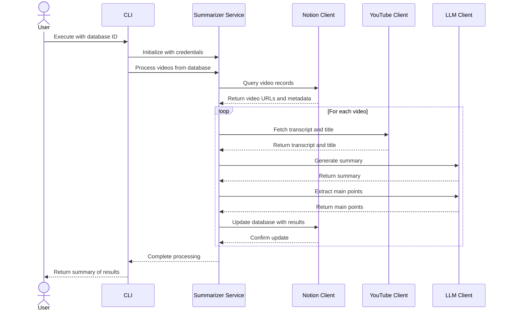

# YouTube Summarizer

<!-- markdown-link-check-disable-next-line -->

[](https://opensource.org/licenses/Apache-2.0)
[](https://github.com/marketplace/actions/super-linter)
[](https://github.com/psf/black)

<!-- markdown-link-check-disable-next-line -->


A Python-based automation tool that retrieves YouTube videos from a Notion database, extracts their transcripts, generates intelligent summaries using Large Language Models, and updates the database with analysis results.

## Key Features

- **Notion Database Integration**: Seamlessly retrieves video records from Notion databases containing YouTube URLs.
- **YouTube Data Extraction**: Automatically fetches video titles and complete transcripts from YouTube.
- **LLM-Powered Analysis**: Generates concise summaries and extracts key points using configurable language models.
- **Transcript Management**: Handles video transcript retrieval and storage through the YouTube Transcript API.
- **Database Updates**: Persists analysis results back to the Notion database for easy reference and collaboration.
- **Configuration Flexibility**: Supports both local models (via Ollama) and cloud-based LLM services through LiteLLM integration.
- **Comprehensive Logging**: Provides detailed logging output for monitoring and troubleshooting the processing pipeline.

## Use Cases

- **Content Curation**: Automatically summarize video content for knowledge management and documentation.
- **Research Archive**: Build and maintain searchable archives of video summaries for research purposes.
- **Team Collaboration**: Store video insights and key takeaways in Notion for team access and discussion.
- **Content Review**: Quickly review important points from videos without watching entire playbacks.
- **Knowledge Base Development**: Create structured documentation based on video content analysis.

## Workflow

The application follows a complete pipeline for video processing:



## Getting Started

### Prerequisites

- Python 3.10 or higher
- Notion API token (create at [Notion integration](https://www.notion.so/profile/integrations))
- Notion database with video records containing YouTube URLs
- LLM API access (either local Ollama instance or cloud-based service)

### Installation

1. Clone the repository and navigate to the project directory
2. Install the package with dependencies:

```bash
uv sync
source .venv/bin/activate
```

### Running the Application

Execute the CLI with the required Notion database ID:

```bash
export NOTION_API_TOKEN="your-notion-token-here"
yt_summarizer --notion-db-id "your-database-id" --model "ollama/llama3.2" --api-base "http://localhost:11434"
```

#### Configuration Options

- `--notion-db-id`: Notion database ID (required, or set `NOTION_DATABASE_ID` environment variable)
- `--model`: LLM model identifier (default: `ollama/llama3.2`, or set `LLM_MODEL`)
- `--api-base`: LLM API base URL (default: `http://localhost:11434`, or set `LLM_API_BASE`)
- `--log-level`: Logging verbosity - DEBUG, INFO, WARNING, ERROR, or CRITICAL (default: INFO)

## Environment Variables

| Name                  | Default                      | Description                                                   |
| --------------------- | ---------------------------- | ------------------------------------------------------------- |
| NOTION_API_TOKEN      |                              | Notion API authentication token (required)                    |
| NOTION_DATABASE_ID    |                              | The ID of the Notion database containing videos (required)    |
| LLM_MODEL             | ollama/llama3.2              | The LLM model identifier to use for analysis                  |
| LLM_API_BASE          | http://localhost:11434       | The base URL for the LLM API endpoint                         |

