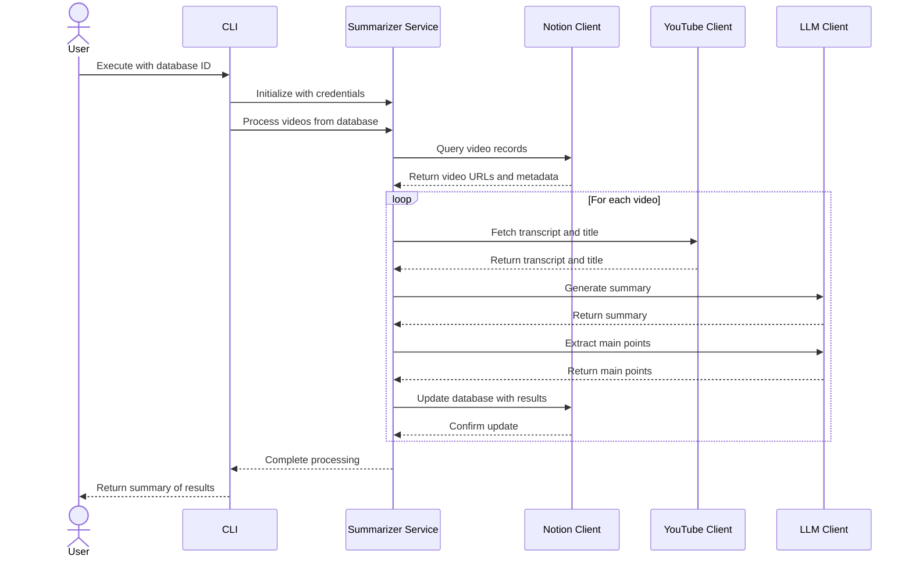

# YouTube Summarizer

<!-- markdown-link-check-disable-next-line -->

[](https://opensource.org/licenses/Apache-2.0)
[](https://github.com/marketplace/actions/super-linter)
[](https://github.com/psf/black)

<!-- markdown-link-check-disable-next-line -->


[](https://github.com/boyter/scc/)
[](https://github.com/boyter/scc/)

A Python automation tool that retrieves YouTube videos from a Notion database, extracts their transcripts, generates intelligent summaries using Large Language Models, and updates the database with results.


## Key Features

- **Notion Integration**: Retrieves video records from Notion databases containing YouTube URLs
- **YouTube Transcript Extraction**: Automatically fetches video titles and transcripts
- **LLM-Powered Summaries**: Generates concise summaries and extracts key points using configurable language models
- **Flexible Configuration**: Supports local models via Ollama and cloud-based services through LiteLLM
- **Database Synchronization**: Persists analysis results back to Notion for team collaboration
- **Detailed Logging**: Monitors and troubleshoots the processing pipeline

## Use Cases

- **Content Curation**: Summarize video content for knowledge management
- **Research Archives**: Build searchable archives of video summaries
- **Team Collaboration**: Store video insights in Notion for discussion
- **Efficient Reviews**: Extract key points without watching entire videos
- **Documentation**: Create structured knowledge bases from video analysis

## Workflow

The application processes videos through a complete pipeline:



## Getting Started

### Prerequisites

- Python 3.10 or higher
- Notion API token (create at [Notion integration](https://www.notion.so/profile/integrations))
- Notion database with video records containing YouTube URLs
- LLM API access (local Ollama instance or cloud-based service)

### Installation

1. Clone the repository and navigate to the project directory
2. Install dependencies:

```bash
uv sync
source .venv/bin/activate
```

### Running the Application

The application requires a Notion API token. By default, it reads the token from `/etc/notion/secrets.txt`. You can either:

1. **Create the token file** (recommended for production):

```bash
echo "your-notion-token-here" > /etc/notion/secrets.txt
chmod 600 /etc/notion/secrets.txt
```

2. **Or use environment variable** (for quick testing):

```bash
export NOTION_TOKEN="your-notion-token-here"
```

Then execute the CLI with your Notion database ID:

```bash
yt_summarizer --notion-db-id "your-database-id" --model "ollama/llama3.2" --api-base "http://localhost:11434"
```

Or specify a custom token file location:

```bash
yt_summarizer --notion-db-id "your-database-id" --notion-token-file "/path/to/token/file"
```

#### Configuration Options

- `--notion-db-id`: Notion database ID (required, or set `NOTION_DATABASE_ID` environment variable)
- `--notion-token-file`: Path to file containing Notion API token (default: `/etc/notion/secrets.txt`, or set `NOTION_TOKEN_FILE`)
- `--model`: LLM model identifier (default: `ollama/llama3.2`, or set `LLM_MODEL`)
- `--api-base`: LLM API base URL (default: `http://localhost:11434`, or set `LLM_API_BASE`)
- `--log-level`: Logging verbosity - DEBUG, INFO, WARNING, ERROR, or CRITICAL (default: INFO)

## Environment Variables

| Name               | Default                 | Description                                        |
| ------------------ | ----------------------- | -------------------------------------------------- |
| NOTION_TOKEN       |                         | Notion API token - overrides token file (optional) |
| NOTION_TOKEN_FILE  | /etc/notion/secrets.txt | Path to file containing Notion API token           |
| NOTION_DATABASE_ID |                         | Notion database ID containing videos (required)    |
| LLM_MODEL          | ollama/llama3.2         | LLM model identifier for analysis                  |
| LLM_API_BASE       | <http://localhost:11434>  | Base URL for the LLM API endpoint                  |

### Running in Docker

When running with Docker, mount the secrets file:

```bash
docker run -v /path/to/secrets.txt:/etc/notion/secrets.txt \
  -e NOTION_DATABASE_ID="your-database-id" \
  yt-summarizer:latest
```

Or pass the token via environment variable:

```bash
docker run \
  -e NOTION_TOKEN="your-notion-token-here" \
  -e NOTION_DATABASE_ID="your-database-id" \
  yt-summarizer:latest
```

## Example

See this [Notion page](https://www.notion.so/electrocucaracha/30526c1a725580a2925acf6d06c53f07?v=30526c1a7255808ca3da000ceba79566) for an example result.
