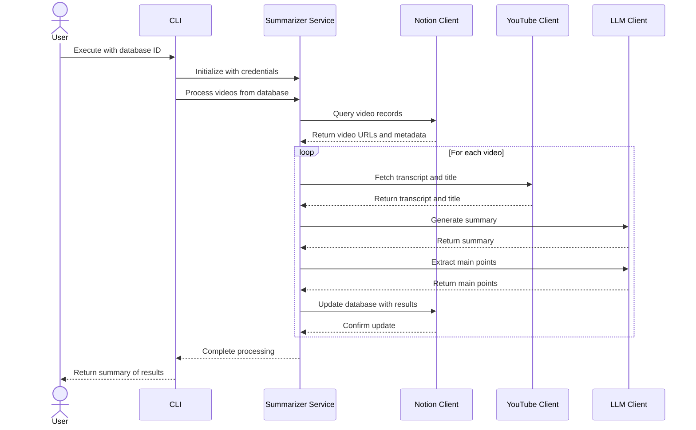

# Workflow

The application processes videos through a complete pipeline:

> **Note**: The CLI now includes enhanced error handling for unreachable LLM endpoints, providing specific connection error messages.
