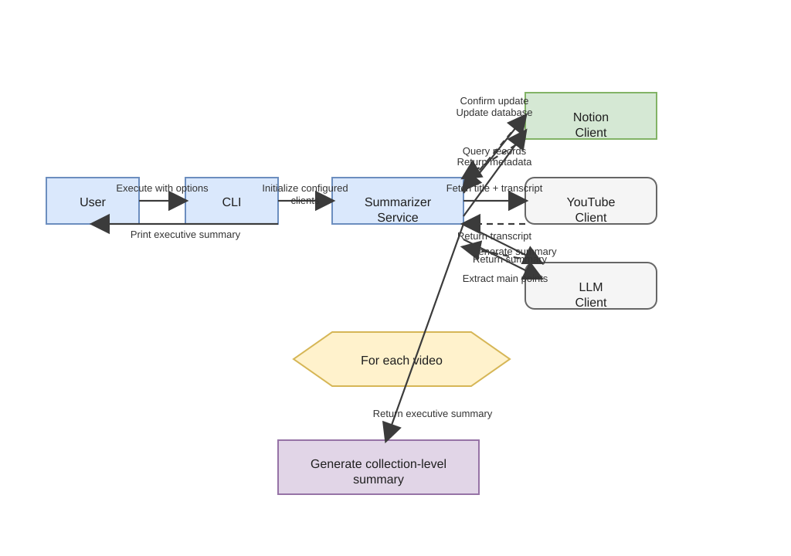

# How the processing pipeline works

The application treats a video as a record that can be enriched over time.
Storage backends supply existing records, the YouTube client supplies missing
metadata and transcript text, and the LLM client supplies the analysis fields.
The service compares the persisted fields before and after processing, so it
does not rewrite an unchanged video.

The source diagram is stored in the draw.io format at [../assets/processing-pipeline.drawio](../assets/processing-pipeline.drawio) and was converted from the Mermaid version to a draw.io-backed asset.

## Storage behavior

Notion and filesystem storage are independent backends.
Notion mode reads database rows and updates their persisted properties.
Filesystem mode writes an OKF bundle consisting of a root index, a playlist
concept, a playlist index and readme, and one Markdown concept per video.
When both are configured, successful changes are written to both backends.

## Analysis behavior

Each video summary is limited to 2,000 characters and each main-points result is
limited to 2,000 characters by the prompts sent to the model.
The executive summary is limited to 6,000 characters.
For Ollama models, long inputs are reduced through a chunked map-reduce chain
before the final request; other LiteLLM model names receive the transcript as-is.

The executive summary uses only non-empty video summaries.
Large collections are reduced in groups of 25 summaries until one result
remains.

## Failure boundaries

Transcript retrieval returns no transcript for age-restricted, unavailable,
unplayable, disabled, or unsupported-language videos, so those videos cannot be
analysed during that run.
Connection failures from the configured LLM endpoint become an actionable CLI
error and end the process with a non-zero exit status.
